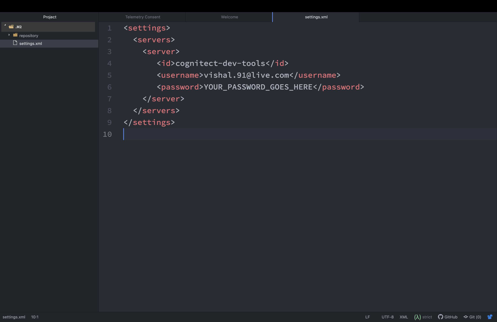
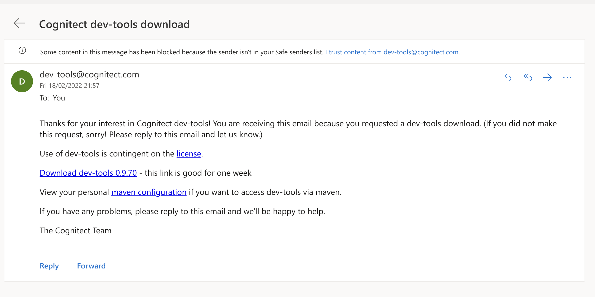
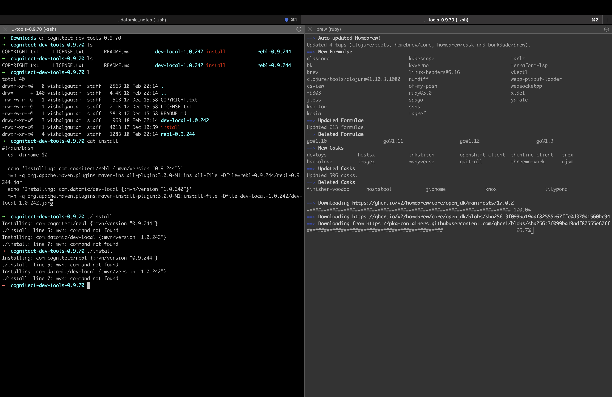
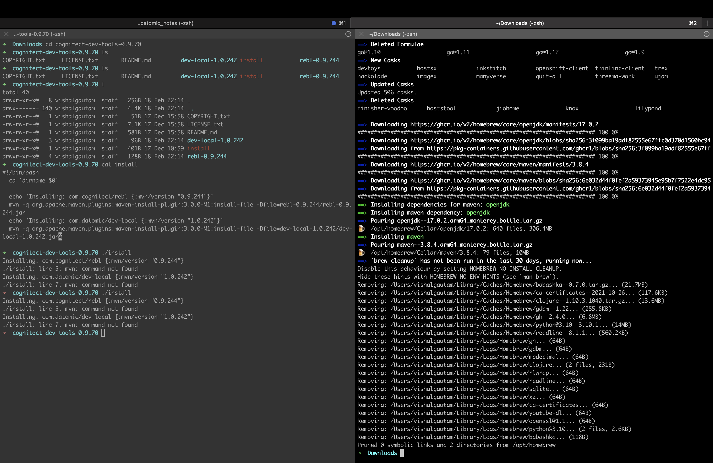

# How to get started with datomic dev local in 5 steps?

Requirements: Before you start the tutorial you should have following installed
- [Java](https://www.oracle.com/java/technologies/downloads/)
- [JDK v17](https://jdk.java.net/17/)
- maven: `brew install maven`
- Clojure: `brew install clojure/tools/clojure`


## Step 1: Download dev-local

- Download cognitect dev-local software (https://cognitect.com/dev-tools).
- You will need to provide a valid email address.

## Step 2: Run `./install.sh` from the downloaded folder

- Check your inbox/junk folder for an email titled "Cognitect dev-tools download" - click on the download link provided in the email. Head over to `downloads` directory
- Unzip the downloaded file and cd into the directory and run the following script `./install.sh`. This script will install following clojure libraries:
    - (rebl)[https://docs.datomic.com/cloud/other-tools/REBL.html] - REBL is a graphical, interactive tool for browsing Clojure data
    - datomic/dev-local - allows you to develop datomic cloud applications locally

```zsh
Installing: com.cognitect/rebl {:mvn/version "0.9.244"}
Installing: com.datomic/dev-local {:mvn/version "1.0.242"}
```

## Step 3: Specify storage location for datomic for local development 

- Next step is to specify the storage location for datomic. 
- Head to home directory and create a directory called `.datomic`avigate to `.datomic` directory and create a file called `dev-local.edn`. Inside the `edn` file create a map and specify the storage directory `:storage-dir`.  
- In my case the value is `/Users/vishalgautam/.datomic/storage`. 
```clj
{:storage-dir "/Users/vishalgautam/.datomic/storage"}
```
Please note that it needs to be a full path. With this done we are done with the dev local. Next step is to configure your secret `settings.yml`

## Step 4: Configure `settings.yml`

- First go to the `home` directory and navigate to `.m2`. 
- Inside `.m2` directory should contain a single directory called `repository`. 
- This directory contains all the cached folders from maven. Lets create a file called `settings.xml`

```sh
➜  .m2 touch settings.xml
```

Next paste the configuration from the email into `settings.xml`



## Step 5: Configure `~/.clojure/deps.edn` file

- Add an entry under the `:mvn/repos` key in your ~/.clojure/deps.edn file. 
- You only need to do this once, nothing else needs to be done per-project to specify maven information.

```
{:mvn/repos {"cognitect-dev-tools"
              {:url "https://dev-tools.cognitect.com/maven/releases/"}}}

```

Once this step is done we are ready to use datomic dev local in our clojure app


---
## Prologue
So lets configure datomic dev local,
so may be first what is datomic dev local
when you want to run datomic cloud, you need to have aws account,
and then in the marketplace you need to buy one of the setups with cloud
formation
That will do everything for you, it simplifies deployment process - with github
as well as running datomic in the cloud

## What is datomic dev local
But in our case, we can use also datomic dev local to do all of the development of our system and then at the very end, we would push this to aws.
so all of the set ups will come later.
for now we are just going to focus on setting up this locally, there is need for aws accounts. everything is ofcourse free, so you dont have to worry about that.
datomic dev local is used for developing your system in a dev environment and also used for the ci tasks so if you want to run any tests and stuff like this

## How to download datomic dev local in your stem
1. Go to this url: https://docs.datomic.com/cloud/dev-local.html
2. On the first step "Setup", you will see link called Get the latest version. Clicking on it will take you to this link: https://cognitect.com/dev-tools
3. When the page loads you you should see the title "Cognitect dev tools". Right below, you will see terms and conditions and below that you will see two things: a input form where you will need to enter your email address. when you click submit cognitect will send you an email with the download link for datomic dev-local.
4. Head over to your email account (i am using live...historical reasons) and you will see in your junk folder an email titled "Cognitect dev-tools download". before you download the software, click on "Not Junk". That way you avoid the risk of this email being deleted in future. Junk emails have expiry date. When I clicked on Not Junk, I was prompted with a dialog titled "Mark as not junk". Right below that was a paragraph that said "This message will be moved to Inbox".
And right below that was a check box to "Never send messages from dev-tools@cognitect.com" to the junk folder. I clicked on the check mark and hit ok button moving the email to my inbox.
5. go to inbox, find the email with a content like this


6. Click on Download dev-tools 0.9.70 (for me). Clicking on the download link will download a zip file contain all the datomic dev tool goodies.

7. Next head over to your downloads section, click on the downloaded file. This will start unzipping the file and once done, it will create a folder containg the software. Next step is configuration. If you look at the image - right below the download link.
You shoul see some like "View your personal maven configuration" where maven configuration is hilighted in blue (its a link). Clicking on the link opens new page. This is your personal configuration page. We will need to set up couple of things here:
- Set up `deps.edn`
- Set up the `~/.m2/settings.yml` file

## How to setup datomic on your computer?

### Step 1: Install devtools using `install` script

After downloading the cognitect dev tools, we can now install them. So they should end up in your download folder. Head over to downloads folder and cd inside the unzipped folder mine is called `cognitect-dev-tools-0.9.70`. If you type `l` command, you should see the following files printed
```
total 40
drwxr-xr-x@   8 vishalgautam  staff   256B 18 Feb 22:14 .
drwx------+ 140 vishalgautam  staff   4.4K 18 Feb 22:14 ..
-rw-rw-r--@   1 vishalgautam  staff    51B 17 Dec 15:58 COPYRIGHT.txt
-rw-rw-r--@   1 vishalgautam  staff   7.1K 17 Dec 15:58 LICENSE.txt
-rw-rw-r--@   1 vishalgautam  staff   581B 17 Dec 15:58 README.md
drwxr-xr-x@   3 vishalgautam  staff    96B 18 Feb 22:14 dev-local-1.0.242
-rwxr-xr-x@   1 vishalgautam  staff   401B 17 Dec 10:59 install
drwxr-xr-x@   4 vishalgautam  staff   128B 18 Feb 22:14 rebl-0.9.244
```


If you run `cat install`, you should see the following string printed on console
```
#!/bin/bash
  cd `dirname $0`

  echo 'Installing: com.cognitect/rebl {:mvn/version "0.9.244"}'
  mvn -q org.apache.maven.plugins:maven-install-plugin:3.0.0-M1:install-file -Dfile=rebl-0.9.244/rebl-0.9.244.jar
  echo 'Installing: com.datomic/dev-local {:mvn/version "1.0.242"}'
  mvn -q org.apache.maven.plugins:maven-install-plugin:3.0.0-M1:install-file -Dfile=dev-local-1.0.242/dev-local-1.0.242.jar%
```

To install the software run the following script
```sh
> ./install
```

ERROR: 1
```
Installing: com.cognitect/rebl {:mvn/version "0.9.244"}
./install: line 5: mvn: command not found
Installing: com.datomic/dev-local {:mvn/version "1.0.242"}
./install: line 7: mvn: command not found
```

Google: "mvn: command not found"
Result: [stackoverflow](https://stackoverflow.com/questions/21028872/mvn-command-not-found-in-osx-mavrerick)
- First download maven
- Second give up and 

Plan B: Use brew to install maven

```
brew install maven
```


After installation it should look something like this



Once the installation is complete we can try tunning the `install` script again. 

Now if you try running the `install` script, it should install two things:
```sh
➜  cognitect-dev-tools-0.9.70 ./install
Installing: com.cognitect/rebl {:mvn/version "0.9.244"}
Installing: com.datomic/dev-local {:mvn/version "1.0.242"}
➜  cognitect-dev-tools-0.9.70
```

As you can see it has installed two things for us
1. com.cognitect/repl v0.9.244
2. com.datomic/dev-local v1.0.242

### Step 2: Create folder for local storage of datomic
This folder needs to be in home directory. So lets navigate to home using the cd directory
```
➜  cognitect-dev-tools-0.9.70 cd
➜  ~
```
Once there, we need to create a directory called `.datomic`

```sh
➜  ~ mkdir .datomic
```
After that, we need to create a file inside this folder. So we will navigate to .datomic directory and create a file called `dev-local.edn`

```sh
➜  ~ cd .datomic
➜  .datomic touch dev-local.edn
➜  .datomic ls
dev-local.edn
➜  .datomic
```

Once this file is created, we will created a folder inside `.datomic` directory called `storage`. FYI you can name this directory anything you want, This is where I am going to save all the files - all the database related stuff will be saved here

Next we need to update `dev-local.edn`, We need to tell this file the location of the directory that we jsut created so datomic knows the location of the directory.

In the `dev-local.edn` file we will create a map and give a single propery called 
`:storage-dir` value is a string, a path to the directory in my case its `/Users/vishalgautam/.datomic/storage`. This is what I meant I said that the directory could have been named anything. All you need to do is make sure the directory name should match with value in :storage-dir

```clj
{:storage-dir "/Users/vishalgautam/.datomic/storage"}
```
It needs to be a full path. With this done we are done with the dev local.

Next lets configure maven

## How to setup maven on your computer?

The other bit that we need to configure is the maven configuration and this was in this `./m2` folder

First go to the home directory and navigate to `.m2`
```
➜  .datomic cd
➜  ~ cd .m2
➜  .m2
```

Inside `.m2` directory should contain a single directory called `repository`. This directory contains all the cached folders from maven. Lets create a file called `settings.xml`

```sh
➜  .m2 touch settings.xml
```

Next paste the configuration from the email into `settings.xml`


## How do I configure tool.deps

Add an entry under the `:mvn/repos` key in your ~/.clojure/deps.edn file. You only need to do this once, nothing else needs to be done per-project to specify maven information.


Next we need to configure `tool.deps`. Lets go back to home directory

```
➜  .m2 cd
➜  ~

```
Lets cd into `.clojure` directory and open it with your favourite text editor

If we type `ls`, we should see two things
```
➜  .clojure ls
deps.edn tools
➜  .clojure

```
1. `deps.edn` file
2. `tools` directory

The deps.edn file describes the information needed to build a classpath.
- When using the `clojure` or `clj` script, there are several deps.edn files that are combined:
    - install-level
    - user level (this file)
    - project level (current directory when invoked)

- For all attributes other than :paths, these config files are merged left to right.
- Only the last :paths is kept and others are dropped.

We need to add this to our deps.edn file
```
{:mvn/repos {"cognitect-dev-tools"
              {:url "https://dev-tools.cognitect.com/maven/releases/"}}}

```

Once this step is done we are ready to use datomic dev local in our clojure app

